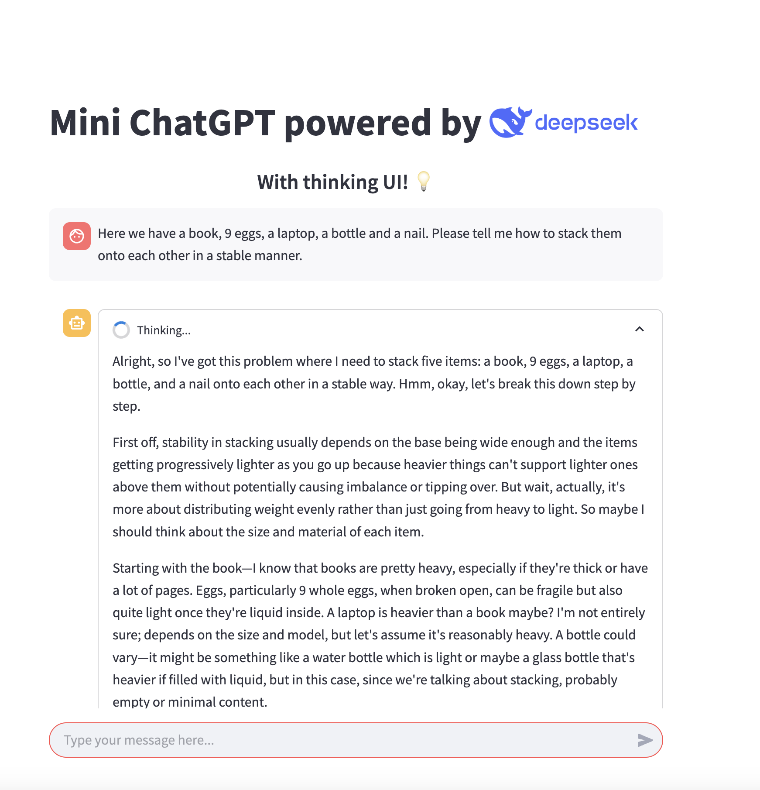

# Local ChatGPT with Thinking UI

This project leverages DeepSeek-R1 and Streamlit to create a lightweight, locally running ChatGPT-style chatbot with a unique "thinking" UI.

## Features
- 💡 **Thinking UI**: Displays reasoning steps separately before responding.
- ⚡ **Streaming Responses**: Get answers in real-time.
- 🔒 **Runs 100% Locally**: No API keys or internet required once set up.
- 🎨 **Minimalist Interface**: Simple and intuitive chat experience.

## Installation and Setup

### 1️⃣ Install Ollama (Linux/macOS)
Ollama is required to run the DeepSeek-R1 model locally.
   ```bash
   curl -fsSL https://ollama.com/install.sh | sh
   ```
On Windows, follow [Ollama's installation guide](https://ollama.com).

### 2️⃣ Download the DeepSeek-R1 Model
   ```bash
   ollama pull deepseek-r1
   ```

### 3️⃣ Install Dependencies
Ensure you have **Python 3.11 or later** installed, then run:
   ```bash
   pip install streamlit ollama
   ```

### 4️⃣ Run the App
Start the chatbot by running:
   ```bash
   streamlit run app.py
   ```

## How It Works
1. The assistant first "thinks" about the response (displayed in an expandable section).
2. Once the reasoning phase is done, the final answer is shown.
3. Messages are stored in session state for context retention.

## Screenshots
This UI displays an animated Thinking... phase before the assistant provides its response, creating a more natural conversation flow.



## Contributing
We welcome contributions! If you have improvements or new features in mind, feel free to fork the repo and submit a pull request.

## License
This project is licensed under the MIT License.

Happy chatting! 🤖💬

